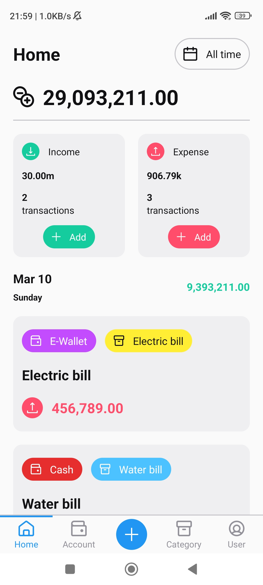
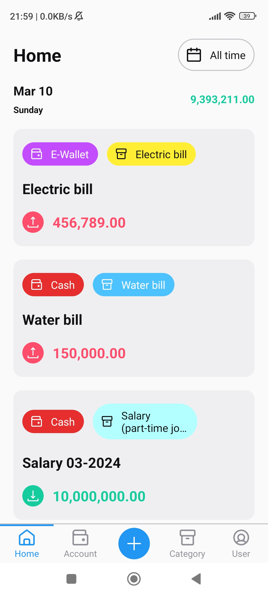
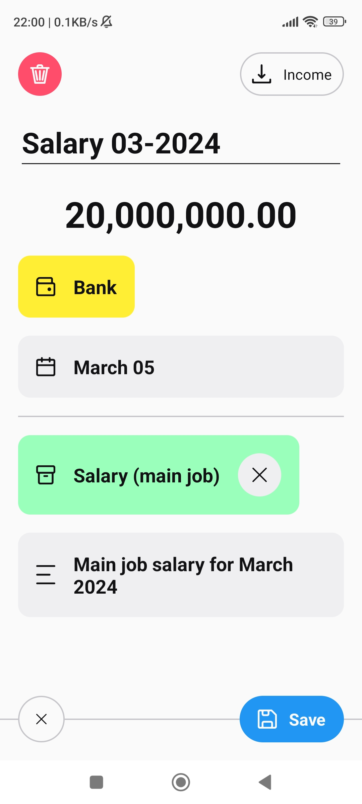
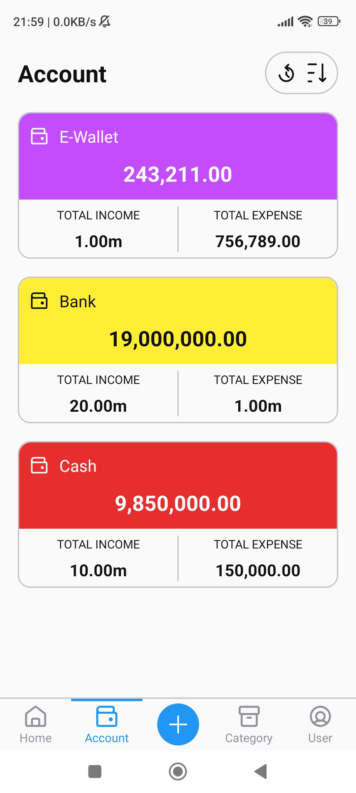
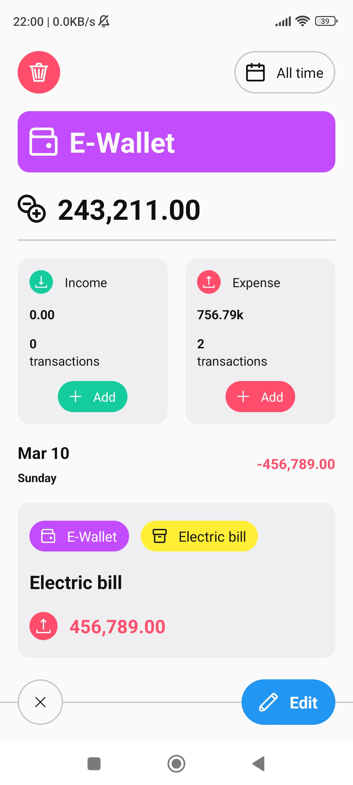
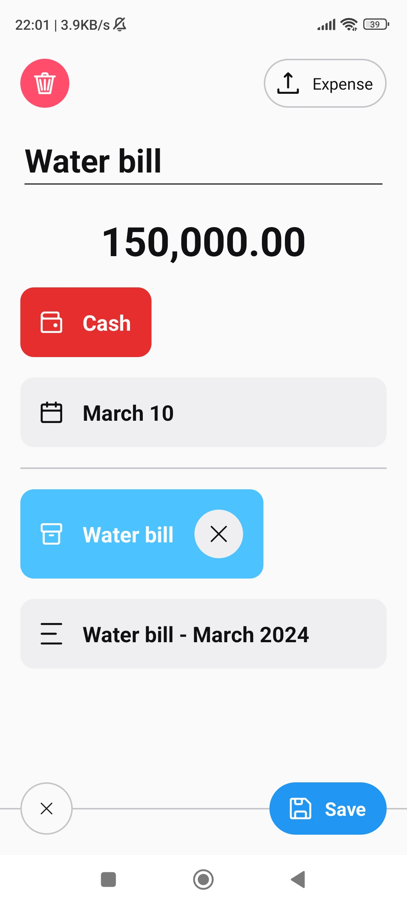
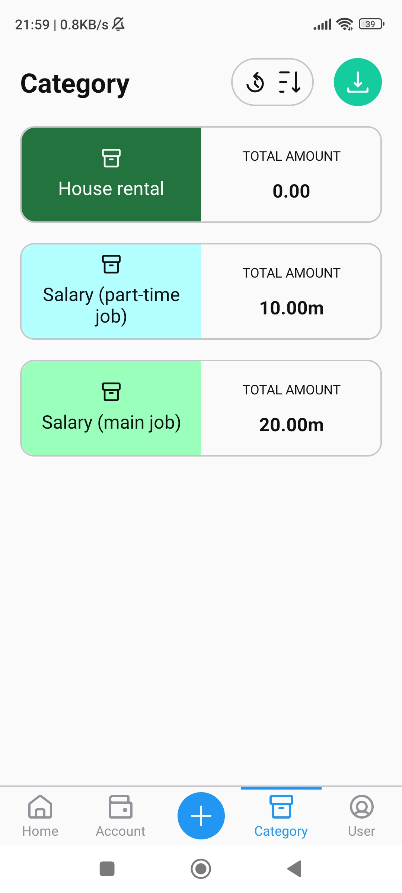
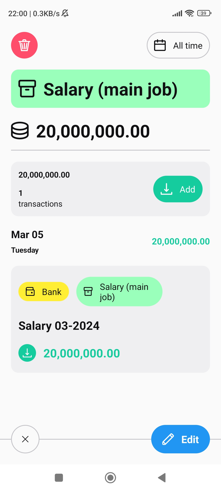
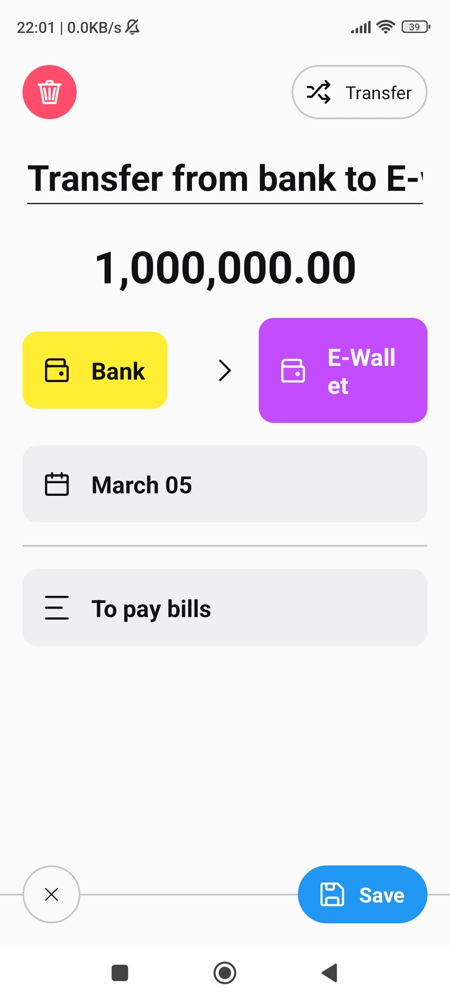

# EZ Wallet

EZ Wallet is my attempt to create a simple money manager based on [Ivy Wallet](https://github.com/Ivy-Apps/ivy-wallet) but with Java and XML-based UI.

Click [here](https://www.figma.com/file/tl7m8u09Brhas0Ws4AHVCq/EZ-Wallet) to view app icon design.

## Screenshots

|   |   |   |
|:-:|:-:|:-:|
||||
||||
||||

---

## Technical details

- Java 17 with XML-based UI
- Architecture: MVVM, single-activity
- Room for local data persistence
- RxJava3 for accessing Room database
- ViewModel and LiveData for UI states
- RecyclerView with ListAdapter and DiffUtil for displaying live data list

---

## To do

### Technical

- Create a consistent style for dimension and widget
- Save and restore UI states in case of configuration changes, process death, ...
Consider using [Jetpack Navigation](https://developer.android.com/guide/navigation)
- Implement DI with [Hilt](https://developer.android.com/training/dependency-injection/hilt-android)

### Functional

- Light/dark theme switching
- Icon selection
- User screen: User info, settings, ...
- Multiple currencies with exchange rates
- Recurring transactions
- Quick transaction search based on title/description
- Reports
- Export data to CSV
